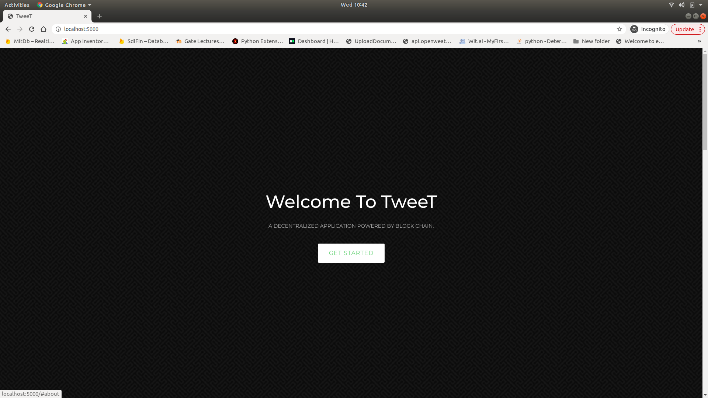
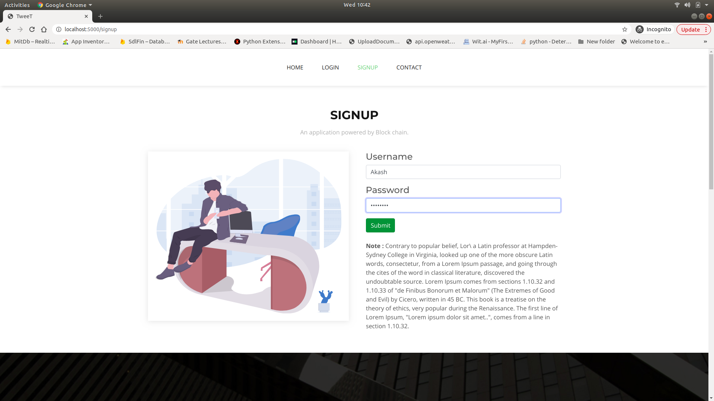
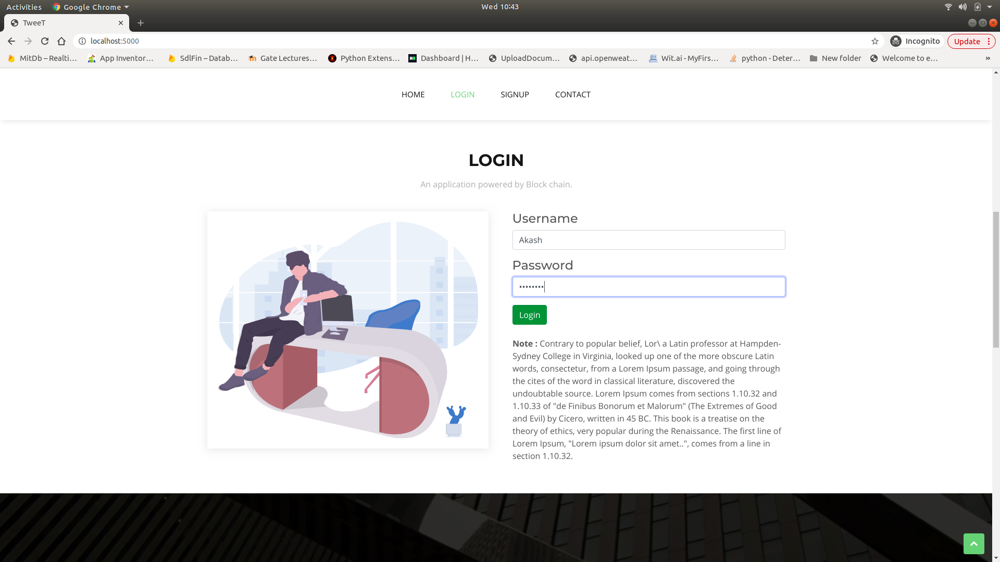
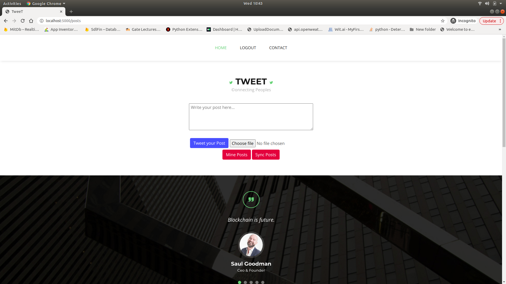
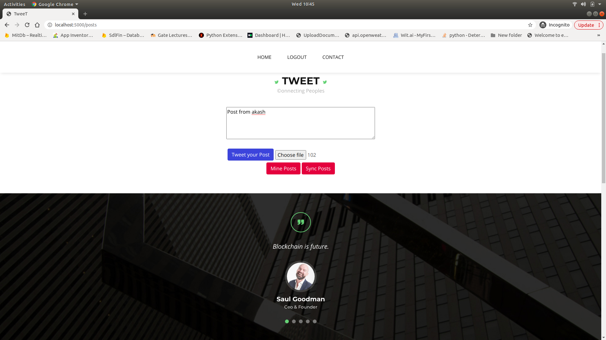
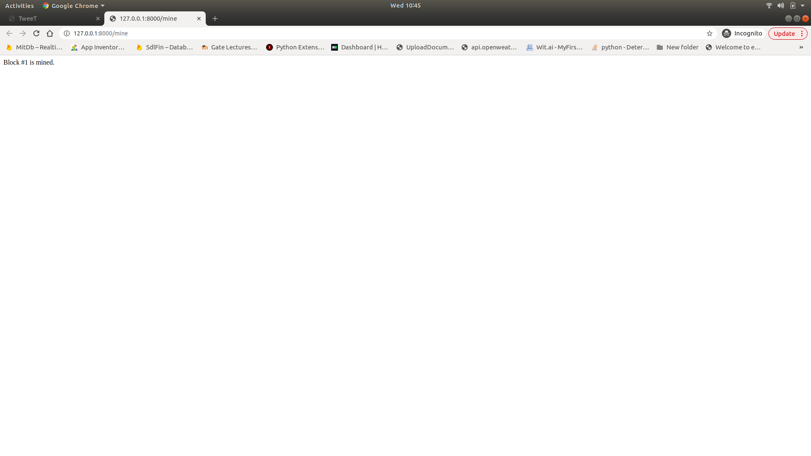
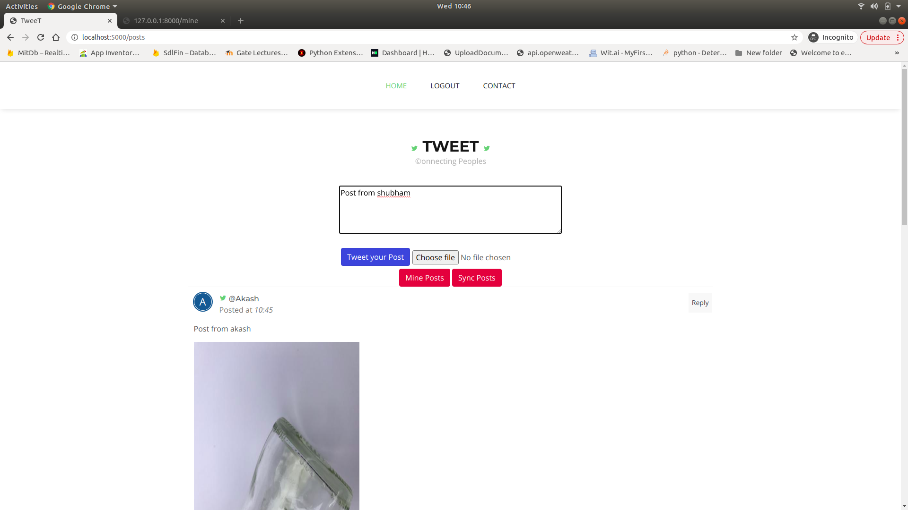
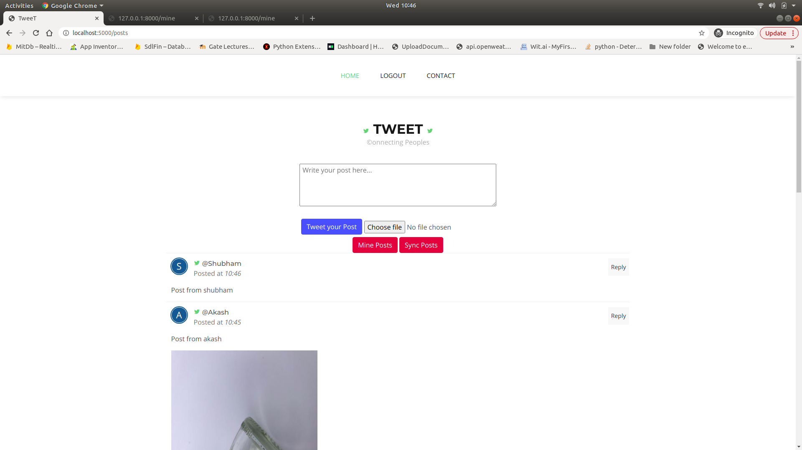

# Twitter_Application_Using_Blockchain

## Install the dependencies,
pip install -r requirements.txt

## To run twitter application,
python run_app.py

## To run multiple nodes in different terminals

### Terminal 1
export FLASK_APP=node_server.py
flask run --port 8000

### Terminal 2
export FLASK_APP=node_server.py
$ flask run --port 8001

### Terminal 3
export FLASK_APP=node_server.py
$ flask run --port 8002

### Terminal 4
#### Register Nodes 8001 and 8002 to 8000,

curl -X POST \
  http://127.0.0.1:8001/register_with \
  -H 'Content-Type: application/json' \
  -d '{"node_address": "http://127.0.0.1:8000"}'

curl -X POST \
  http://127.0.0.1:8002/register_with \
  -H 'Content-Type: application/json' \
  -d '{"node_address": "http://127.0.0.1:8000"}'
  
 
## Application Screenshots

### Landing page 

### Signup page

### Login page

### User page
- Unless any blocks in the blockchain are mined, users will see default page with no tweets

- User can write, attach an image to the post and can tweet it, Unless the users in chain mines the block the post is not published
 

- Users can mine the post/block in the chain to publish the tweets

- Post once mined is visible to all the users registered with this application

- Posts from other users 

